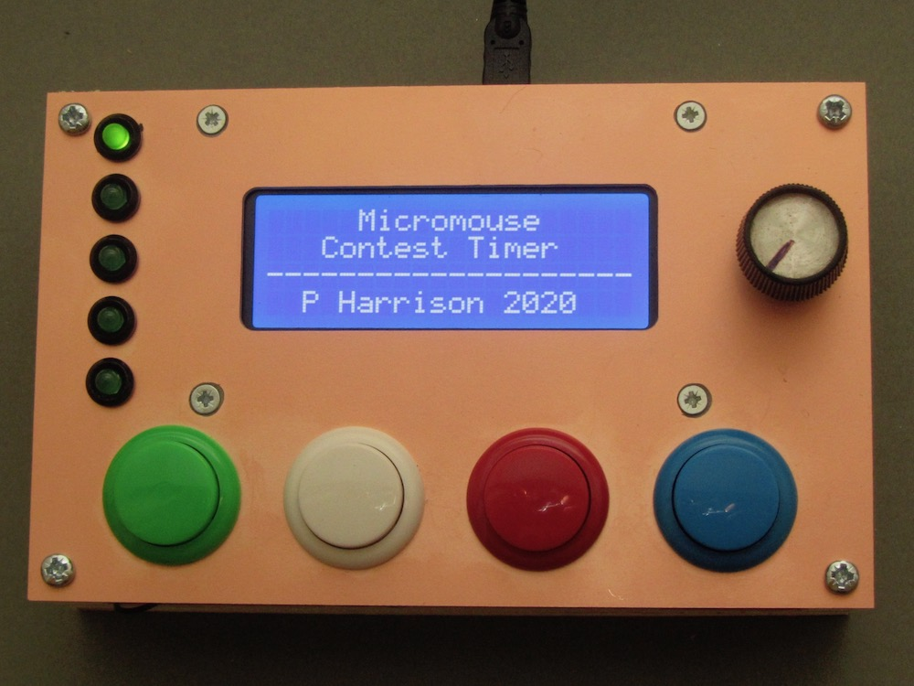

# micromouse-timer
Hardware and software for a micromouse classic contest timing system

## Design goals
Many micromouse timing systems rely on devices placed in the posts to create a break-beam arrangement. An emitter in one post produces an optical signal that is detected by a matched receiver in the other post. Commercial break-beam devices are available from companies like Omron but they are very expensive, Simpler arrangements an be made with just an LED and phototransistor. For the most reliable operation, the measuring setup really needs to control both the emitter and detector synchronously so that it can detect the breaking of the beam under a wide range of ambient lighting conditions.

This need to connect one controller to both posts makes it necesary to get access to the posts from under the maze. Not only will that require the maze to be raised off the floor by some amount, it makes it very difficult to move the gates after the maze has been set up. Ideally, any timing system should not need any physical connections between components in the maze.

The APEC maze uses a gate sensor system that can be placed anywhere and only needs to be present on one side of the opening. It manages this by using a reflective sensor that measures the distance to the far post. These sensors are similar to those used in the popular Sharp distance sensors by they are have a much faster response time. The Sharp sensors canot be polled every milisecond to get high resolution timing. Unfortunately, making the reflective sensors is quite complicated and requires a certain amount of signal processing circuitry. It is not something that is terribly easy to reproduce.

When making a timing gate sensor, consideration must be given to the robots in the maze. They typically generate very high intensity pulses of IR or visible red light from multiple emitters at 1000Hz or more. Not only should the timing system be unaffected by these pulses, it should also not interfere with the robot's ablity to make measurements. Thus, the robot must not cause timing errors and the timing syste must not make the robots crash.

Finally, there is the issue of ambient lighting levels. These are variable from venue to venue and may vary greatly even during a contest. A venue with natural light may have direct sunlight into the room and, clearly, that light will move around during the day. Other sources of interfering ambient light might include camera lights and camera flashguns. theese too should not interfere with the operation of the timing system.

With so many constraints, it would be natural to seek ever more sophisticated solutions to overcome them.

After several experiments with 'clever' designs, this project tries to make everything as simple as possible.

## Components
There are four components for this timing system
1. gate emitters  - these are just blue LEDs connected to a single Lithium cell with a single current limit resistor. They operate continuously for up to 36 hours between charges.
2. gate receivers - these have a phototransistor with a single load resistor connected to an analogue input channel on an Arduino. The Arduino is also connected to a small 433MHz radio module so that it can send detected changes to a timing controller. Again, a single Lithium cell provides power for at least 20 hours operation.
3. gate controller - the controller is connected directly to the timing management computer with a USB-serial link. It also has a radio receiver so that it can obtain event information from the gate receivers. Each gate receiver sends encoded packets to identify the event and the gate ID. The controller performs the actual timing function and all the data can be stored on an SD card for independent operation or to provide a backup. Power can come from the host USB connection, batteries or a separate power supply. Optionally, a Bluetooth conenction could be made to the host. Sinca all the communication with the gates is wireless, the controller can be placed several metres away from the maze and there are no trailing wires to the maze.
4. timing manager - the software running on the host computer that accepts timing information from the controller, presents it on the display screens and maintains the contest results.

## Gate Operation
Each gate has an emitter and a receiver.

### Emitters
The emitter generates a continuous beam of illumination using blue light. Green light would be a good alternative. While apparently very bright to the human eye, typical micromouse sensor will be relatively insensitive to these wavelengths and, in any case, will perceive the illumnation as part of the background and so it should be compensated for. Blue LEDs have quite high forward voltages of around 2.8 to 3.0 Volts but can still be run from a single Lithium cells with a small series current limiting resistor. Using a resistor value of 39 Ohms with the chosen device limits the maximum current to around 27mA with a fully charged battery at 4.2Volts. As the battery discharges to a nominal 3.7 Volts, the current decreases to about 15mA.

The battery is a Nokia BL-4S with a nominal capacity of 860 mAhr. Once turned on, there should be sufficient capacity for at least 36 hours operation.

A TP4056-based battery charge and protect circuit prevents over discharge of the battery and allows for easy re-charging from a 5V source such as a cell-phone charger of portable power bank.

The emmitter assembly is entirely contained within a typical plastic classic wall. Light shines through a hole in the end of the wall and a corresponding hole is a post. Where the gate must be perpendicular to the wall, a special post is used that contains an embedded reflector at 45 degrees. The reflecto involves a failry large aamount of light loss but is still sufficent for the task. Straight-through emitters might benefit from lower intensity and this could be provided with an additional switch to change the current limit resistor.

### Detectors
The detector circuit is minimal. It consistes of a TEPT5600 visible light phototransistor with a 2200Ohm load resistor on the emitter. The transistor emitter is connected directly to an analogue channel on an arduino mini-pro. The load resistor is selected to give a reading of between 20 and 60 counts when illuminated only by the LED in the timing gate in its normal operating configuration. This is quite a low sensitivity but it ensures that operation will be relatively unaffected even by quite bright ambient illumination right up to the point of saturation of the phototransistor

Attached to a software serial TX pin on the Arduino is a self-contained radio transeiver used only in its transmit mode. the radio is powered down until the gate is interrupted. When messages are to be sent, the radio is powered up, placed in transmit mode and the message is transmitted several times to ensure reliable communication. Aferards, the radio is powered down again to reduce current consumption and prevent interference.

All the radios in the system operate on the same frequency but there should be no natural circumstance where more than one transmits at a time. Thus, the controller needs only one radio and can distinguish the message source from its content.

Like the emitter, the circuitry all fits inside a typical classic maze wall and runs from a BL-4S battery using the same type of TP4056 charge/protect module. In normal operation, the Arduino draws only 12mA and the brief periods of transmission double that for a second or two. Continuous operation should be possible for at least 50 hours with a fully charged BL-4S battery.

### Controller
At the heart of the timing operation is the controller. An Arduino is connected to another LINX radio module which is running continuously in receive mode. It listens for packets from the gate detectors and runs a state machine that looks after all the timing functions related to the current contest.

While intended primarily for micromouse, the same controller could be used for drag race, line follower and time trial contests. Some additional care would be needed to distinguish the transmissions from gates in other contests. The controller passes timing and event notfications to the host computer running event management software using a USB-serial bridge. The same connection can provide power.

So that the controller can be used stand-alone and/or act as a backup to automatic timing, it also has an LCD display and a number of manual buttons that set the state of the system and provide manual gate inputs if needed.

Internally, an SD card records all the incoming and outgoing messages so that they can be retreived for later analysis and toserve as an auxiliary store in case of an error or failure in the management software. Files are time stamped using a data from a battery-backed real time clock module. Note that the RTC battery is not rechargeable and annual maintenance should be carried out to replace the battery and ensure thatthe time and date are correct.
